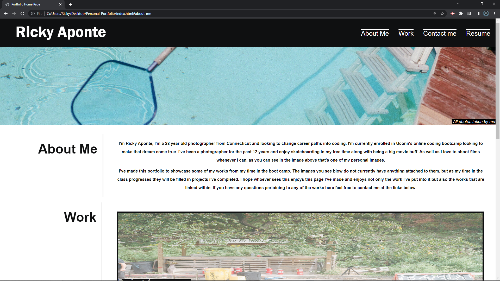
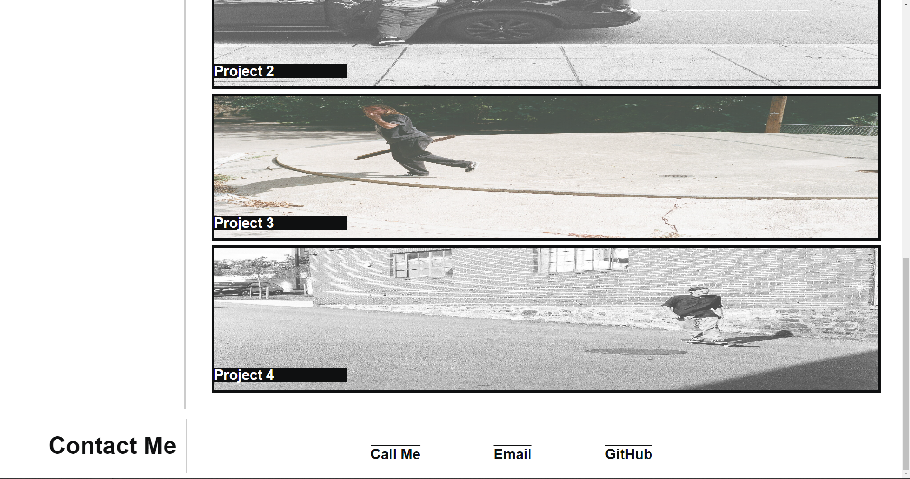
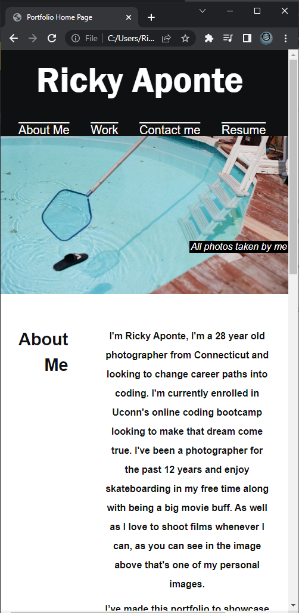
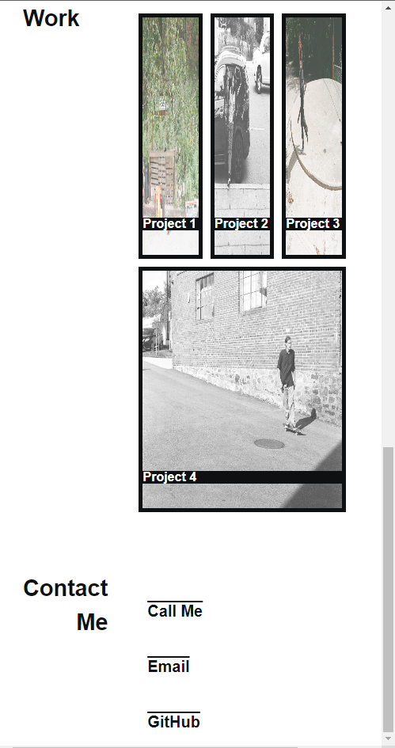

# Enriques Personal Portfolio

## Description

I created my personal portfolio website from scratch with no starter code whatsoever. In the application you will see tabs such as about me, work and contact me all containing  information or works by me.This application’s purpose is to be a central location where all my works from the Uconn bootcamp will be stored to show future employers or clients. In the first deployed version all the photos on the page were all shot by me and are just placeholders to replace when my future projects are finished.

## Usage

In provided screenshots you will see the application at the regular size and the application when the web page is shrunk. Also included in the screenshots will be the title table where you will see “Portfolio Home Page”.

## Features

The main feature of this project is to show future employers or clients my works I’ve made in the Uconn Bootcamp. The links in the top nav bar will bring you down to the correlating sections in the bottom of the page, in the future “resume” will contain my resume with updated works I’ve created. The about me section just states a little about me. When we move over to the Work section, it shows my 4 best projects and at default they are opaque but when you hover over them to click on them when a project is linked in the future they turn to 100% clarity. Lastly the contact me sections links all bring you to either calling my phone number directly, emailing me directly or a link straight to my github to see my current repos inside.

Here is a link to the deployed site.
